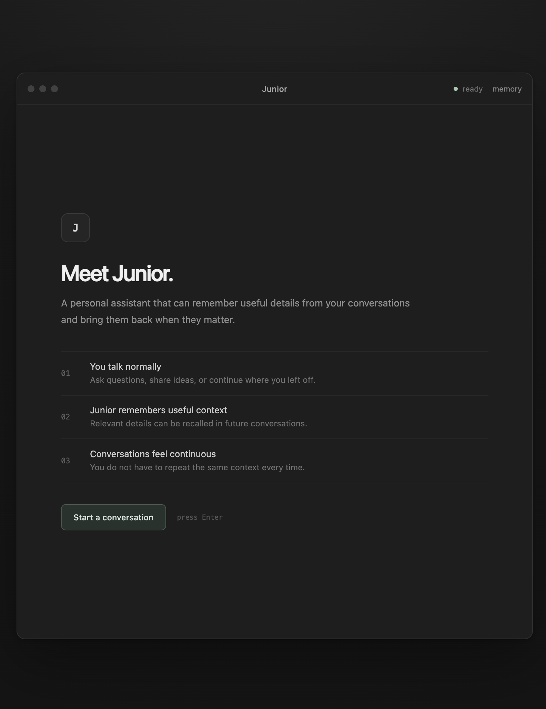
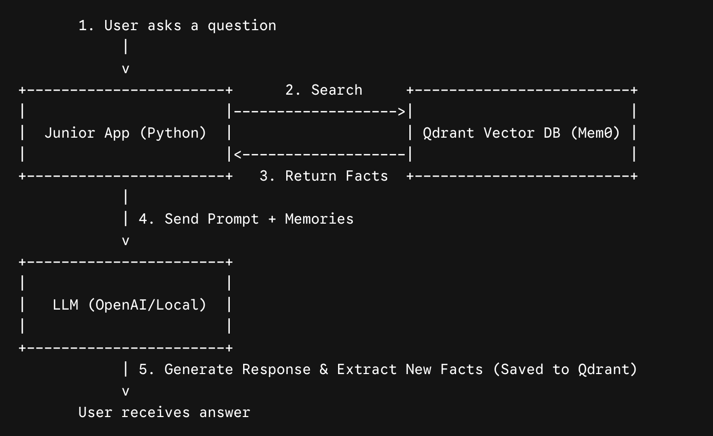
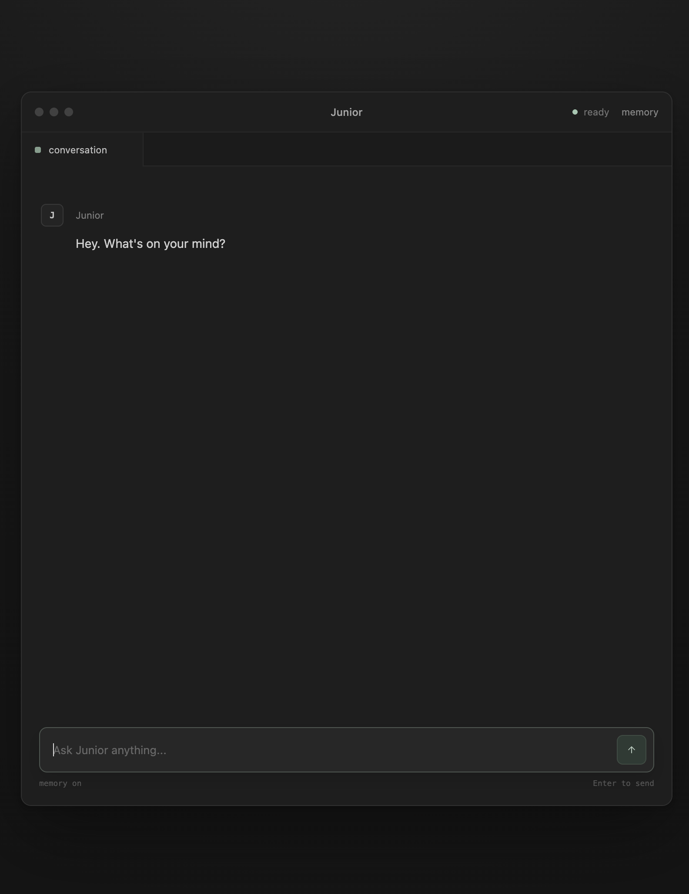

# SubProject (Wing 2)

Junior that remembers details from your past conversations. Built with Python, Django, Mem0, and Qdrant, this project demonstrates how to give large language models (LLMs) long-term memory so you don't have to repeat context every time you chat.





### Prerequisites

Before starting, ensure you have the following installed on your host machine:
- Docker Desktop
- VS Code
- Dev Containers Extension (in VS Code)

### Environment Setup

#### 1. VS Code Dev Container

- Clone this repository and open the folder in VS Code.
- When prompted by the Dev Containers extension, click "Reopen in Container".
- The .devcontainer.json file is pre-configured with the Docker CLI feature, allowing the container to communicate with your host's Docker engine.

#### 2. Create a Virtual Environment (Venv)
Once inside the VS Code container terminal, it is best practice to create an isolated Python virtual environment.

For macOS / Linux:

```python
python3 -m venv .venv
source .venv/bin/activate
```

For Windows (if running locally outside a container):

```python
python -m venv .venv
.venv\Scripts\activate
```

#### 3. Install Dependencies
```python
python -m pip install -r requirements.txt
```

### Configuration: Local Model vs. Cloud AI
This project supports both official OpenAI API models and Local LLMs.

1 . Create a .env file in the root directory:

```python
OPENAI_API_KEY=your_api_key_here
```

2 . Open the code files (model_mem.py, views.py). You will notice the Local Model configuration is commented out, while the OpenAI configuration is active.

3 . To switch to a completely offline local model, simply comment out the OpenAI block and uncomment the local model variables.

### Running the Project

Step 1: Start the Vector Database
Before running any code, you must start the Qdrant database to store memories.

```python
docker compose up -d
```

Step 2: Choose Your Interface
You can interact with Junior in three different ways:

A. Run Tests
To verify that memory extraction and the Qdrant connection are working correctly without starting a full chat session:

```python
python junior_mem_test.py
```

B. Terminal Chat Interface
If you prefer a fast, text-only interface directly in your IDE:

```python
python model_mem.py
```
Type your messages and press Enter. Type exit to quit.

C. Web Interface (Django)
To use the polished web UI:

1 . Apply Django migrations:

```python
python manage.py migrate
```
2 . Start the server:

```python
python manage.py runserver 0.0.0.0:8080
```

3 . Open your browser and navigate to http://localhost:8080.


